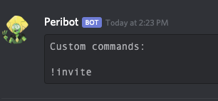
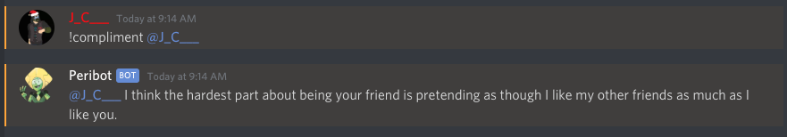
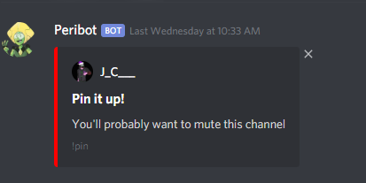
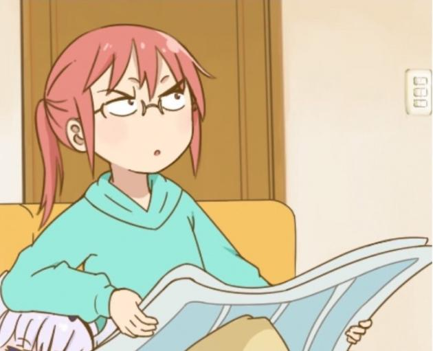

Peribot's Commands
======

## How to read these documentations

`[prefix][command] [arguments]`

- prefix: your servers chosen prefix (defaults to !)
- command: the command that you are running
- arguments any arguments you need to provide

All commands in the docs will be using the default prefix of "!" if you have changed your prefix just substitute it for every command :)

?> Arguments may be surrounded in [] for separation purposes don't use them in your commands.

### Setup Commands

#### !prefix [new prefix]

   **new prefix**: the symbol that you want to use as your servers new prefix.

#### !help

  Sends you a link to this site

  ?> Aliases: !phelp (This helps avoid getting spammed by every bot that may share the same prefix)

#### ping

Returns the Server latency, API latency, and uptime of the bot
 
Ping ***Pong!***

### Custom commands

Server specific commands that you define! This is great for storing FAQs or important links!

?> Aliases: !cc

#### !customcom add [trigger] [response]

Adds a custom command to your server. This works with images too but only if you set the link to the image as the response to your trigger. Triggers can not overlap with existing commands.

  **trigger**: what the bot is listening for to trigger your response

  **response**: the text Peribot replies with when the trigger is sent
  
?> Exmaple: !cc add hello world | Peribot will listen for !hello and respond with "world"

#### !customcom edit [trigger] [response]

Edits a custom command response to something new.

#### !customcom delete [trigger]

Deletes a custom command from your server

#### !customcom list

Lists all the custom commands on your server.

### Fun Commands
Fun commands that typically respond with an image or text

#### !cats

Sends a cat gif/image in the current channel

#### !catsbomb [number]

  **number**: (Optional) the number of images that should be sent

Sends 5 consecutive gifs/images of cute cats!

#### !pugs

Sends a single pug gif/image in the current channel

#### !pugsbomb [number]
  **number**: (Optional) the number of images that should be sent

Sends 5 consecutive gifs/images of cute pugs

#### !eightball [question]

?> Aliases: 8b

  **question**: (Optional) The question that you want Peribot to answer

The bot will answer your question with the typical eight ball fashion.

  **example response**: `Concentrate and ask again.`

#### !topic

Gets a random chat topic to keep the conversation going.

#### !roll [upperbound]

?> Aliases: !r

  **upperbound**: the maximum number of sides on the die you're rolling

Rolls a virtual die and returns the result.

**example**: `!roll 20` -> `:game_die: You rolled a 11`

#### !flip [user]
  **user**: (Optional) The user that you're flipping

Flips a coin ... or a user. But not me.

#### !ded

Shows how dead the chat is... Time to revive it!

#### !uwu [text]

This is a very dangerous command, its full potential has not fully been explored. I would recommend extreme caution when using it.

  **text**: The text that you want to UwU-ify

#### !hug [user]

  **user**: The discord user you are trying to hug

Sends a random gif of a hug to brighten a users day :)

#### !kiss [user]

  **user**: The discord user you are trying to kiss

Sends a random gif of a kiss to brighten a users day :)

#### !compliment [user]

  **user**: The discord user you are trying to compliment

Sends a random compliment to brighten a users day :)

####!bigmoji [emoji]

  **emoji**: the emoji that you want a larger version of

Replies with the a larger image version of the designated emoji.

**example** `!bigmoji :dogoconfused:`

**result** 

###User Info

####!avatar
Get user's avatar in its full form.

### Server Tools

This will contain server tools and moderation commands that can be used to quickly preform actions on your server.

####bigmoji [emoji]
    
  **emoji**: the emoji that you want a larger version of 

####!serverinfo

Replies with an embed containing a basic overview of the server in which the command was run

?> Aliases: !si

####!rolecolor [role] [color]

  **role**: The role you want to change the color of.

  **color**: The color you want to set the role too. This can be a word or a hex
     IE: Red, Green, Orange, #FFF000 etc.

  This will change the color of a role. The user must have Manage Roles permissions to use this command.

  **example** `!rolecolor @Staff Blue`

  **result** Your Staff role is now colored blue!

#### !purge [number]

  **number**: the number of messages that Peribot should delete. Defaults to 5

This will mass delete a set number of messages. The user must have Manage Messages permissions to use this command.

#### !pin [message]

  **message**: The message you want to pin

This will take your message place it in an embed and pin it in the channel that you're in. The user must have Manage Messages permissions to use this command.

#### !kick [user]

Will kick a member. The user must have Kick User permissions

#### !ban [user]

Will ban a member. The user must have Ban User permissions

#### !unban [user]

Will unban a member. The user must have Ban  User permissions

### Moderation Log commands

#### !modlogset channel [channel]

### Meme commands
A collection of commands use to make and share memes.

#### !bill [text]

  **text** the text to be displayed in between "This is Bill" and "Be like Bill"

  **Example** `!bill He uses Peribot on all his servers`

  **Result**
  

#### !kobayashi [top text], [bottom text]

This will generate a "top text - bottom text" meme using this image

You can optionally use just top text or bottom text like this:
`!kobayashi top text only`
`!kobayashi ,bottom text only`

#### !rogu [top text], [bottom text]

This will generate a "top text - bottom text" meme using this image

  **top text**: Text you want to appear at the top of the image. White font color with black outline

  **bottom text**: Text you want to appear at the bottom of the image. White font color with black outline

  Please Note that both the top and bottom text will be fit onto one line and will not wrap based on length. Using longer than normal strings will produce adverse behavior.

You can optionally use just top text or bottom text like this:
`!rogu top text only`
`!rogu ,bottom text only`
